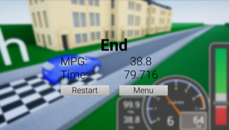
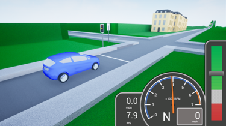
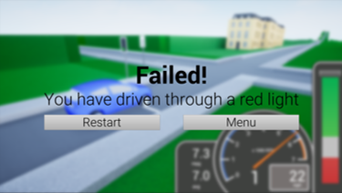

# Eco Academy

## Overview
Eco Academy is a video game built for my final year masters engineering project: "Eco Academy: An educational video game". The game challenges users to drive a vehicle simulation as efficiently as possible in a city driving scenario. Players can adjust vehicle parameters to perfect their vehicle, engaging them in engineering and sustainability.

Included in this repository are the Unreal Engine 4 (UE4) project files. Additionally, my dissertation is included for detailed reference.

## Implementation
The game is created in UE4. I made a vehicle simulation in C++ (repository: https://github.com/tomjhunt13/SimFramework) which I wrapped into a plugin for UE4 (repository https://github.com/tomjhunt13/SimInterface).

## Screenshots
Shown here are screenshots of: the start line of the game, the end screen when the player completes the level, the player waiting at a traffic light and the fail screen when the player drives through a red light.  

